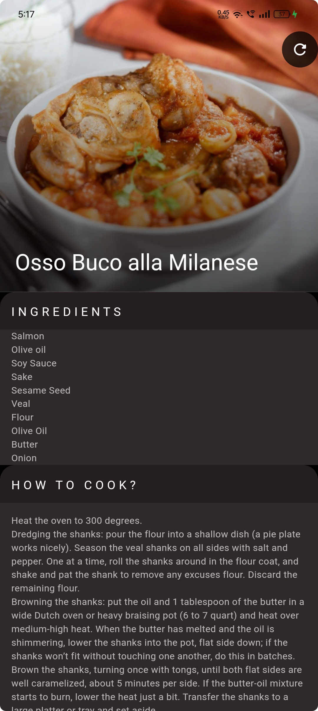

# MealSpin

<p align="center">
  <a href="https://flutter.dev"></a>
  <a href="https://developer.android.com"></a>
  <a href="LICENSE"></a>
</p>


Random Meal Search is a Flutter-based mobile application that lets users discover new dishes instantly using the TheMealDB API. With just a tap, the app fetches a random meal and presents detailed information, including the meal name, category, ingredients with measurements and step-by-step cooking instructions.

---


##  Features
- Random Meal, dishes search 
- Ingredient list with measurements
- Step-by-step cooking instructions
- YouTube video links for recipes

---
##  Screenshots

### Recipe page
<div>
    
  

  
</div>

### Dynamic Loading Screen
<div>
  
</div>

---

##  Tech Stack

- Flutter
- Dart
- TheMealDb API
- http for API calls

---

##  Direct APK Download 
<a href="https://github.com/Dheeraj-Chintala/MealSpin/releases/tag/v1.0.0" download>
  
</a>

---
## OR  Getting Started

1. Clone the repo
   ```bash
   git clone https://github.com/Dheeraj-Chintala/MealSpin.git
   cd MealSpin
2. Get dependencies
   ```bash
   flutter pub get
3. Run
   ```bash
   flutter run
